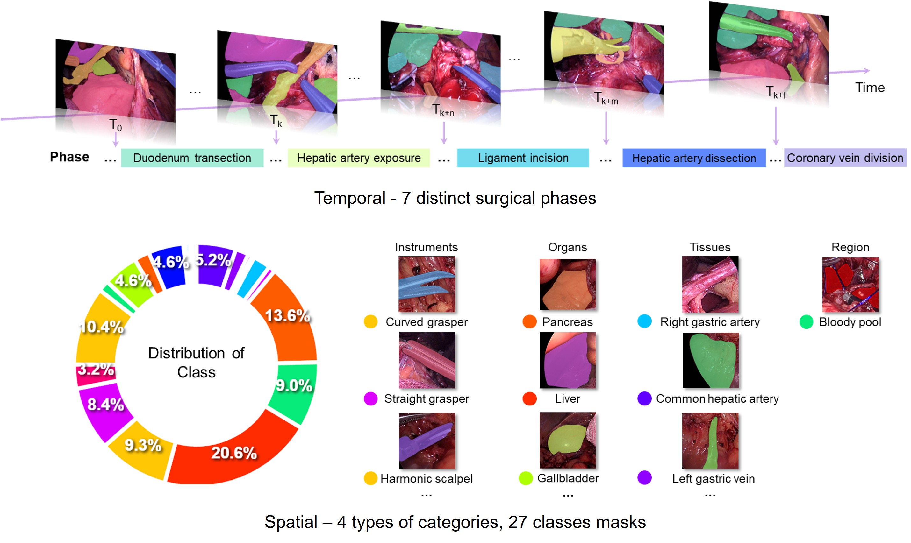
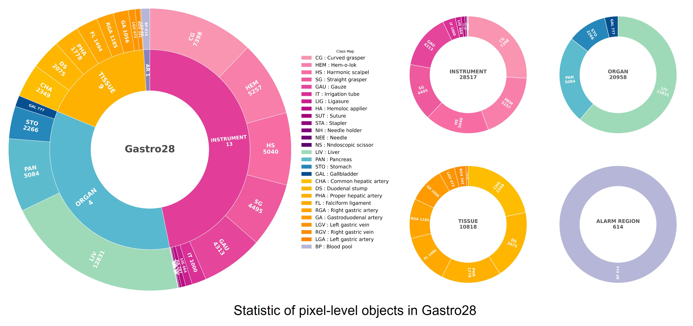
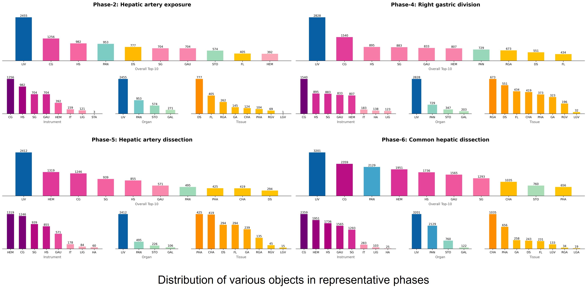
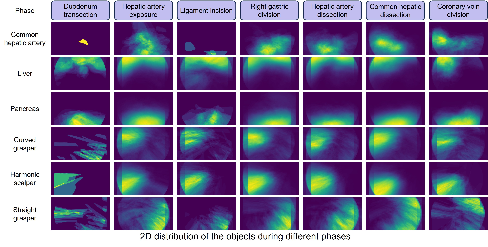
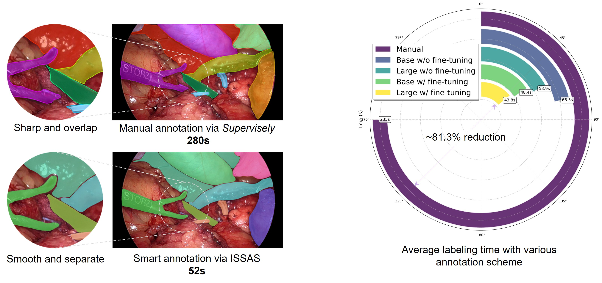
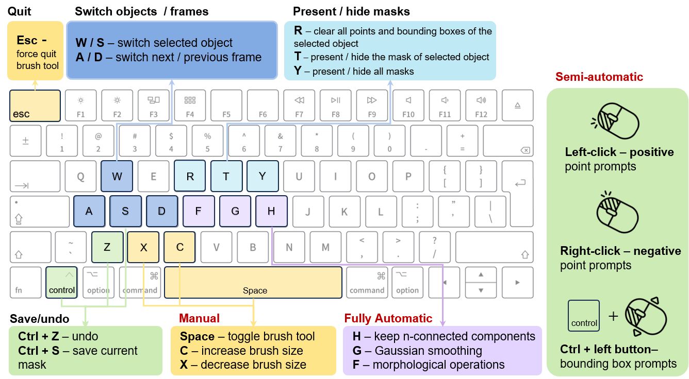

# Gastro28 and ISSAS

### **A Multi-level Gastrectomy Video Dataset and Interactive SAM2-based Smart Annotation System for Surgical Scene Understanding**
*Qixiang Ma, Siew Fung HAU, Wing Yin Ng, Litao Zhao, Yiyi Zhang, Yu Zhu, Qi Dou, Pheng-Ann Heng, Shannon Melissa Chan, Zheng Li*
### International Conference on Medical Image Computing and Computer Assisted Intervention, MICCAI workshop, 2025
 <hr />
 
## I. Overview  

  <p align="justify">
The development of AI for surgical scene understanding is limited by the absence of large-scale, high-quality annotated datasets. We present Gastro28, a gastrectomy video dataset of 28 clinical cases focused on Station 8a, with temporal annotations of 7 surgical phases and pixel-level masks covering 27 semantic classes. To support efficient labeling, we introduce ISSAS, an interactive SAM2-based annotation system enabling semi-automatic, automatic, and manual refinement. ISSAS operates in a bootstrapping loop, combining surgeon-provided bounding boxes with engineer-driven mask refinement to enhance accuracy and reduce annotation effort. Preliminary results show that ISSAS achieves smoother and more precise segmentation than existing models, while maintaining practical annotation time.
  </p> 
<br />

## II. Statistic of Gastro28
The table presents the statistical information of the Gastro28 dataset, including the number of categories and the corresponding number of annotated objects. In addition, the figure provides a visualization of the distribution both across different categories and within each category, offering a clearer understanding of the dataset’s composition and balance.
<div align="center">

**Table: Distribution of classes and objects of Gastro28**
| Class              | Num. of Classes | Num. of Objects |
|--------------------|-----------------|-----------------|
| Instrument         | 13              | 28,517          |
| Organ              | 4               | 20,958          |
| Tissue             | 9               | 10,818          |
| AR (Alarm region)  | 1               | 614             |
| **Total**          | **27**          | **60,907**      |

</div>

  <p align="justify">
   
The following two figures illustrate the distribution of different target objects across various surgical phases. Such information can be leveraged as prior knowledge for robotic-based surgical procedures, providing valuable context for scene understanding and decision-making.


  <p align="justify">

  <p align="justify">

## III. ISSAS - Interactive SAM2-based Smart Annotation System

  <p align="justify">

  <p align="justify">
To enable efficient annotation of the Gastro28 dataset, we developed the Interactive SAM2-based Smart Annotation System (ISSAS). ISSAS takes bounding boxes as input and generates corresponding segmentation masks, which are presented in an interactive user interface. Annotators can refine these masks using three modes of interaction: (1) Semi-automatic: By providing prompts through mouse clicks and drags to guide SAM2 in refining specific regions. (2) Fully automatic: By applying classical image processing techniques such as Gaussian blurring and connected component filtering in a one-click manner. (3) Manual: By using a brush tool to locally add or remove mask regions.

As illustrated in the following figure, ISSAS and its associated tasks are embedded in a bootstrapping loop. After surgical experts annotate a small portion of frames (e.g., 5\%) with class-labeled bounding boxes (A), SAM2 propagates these annotations across the entire sequence (B, C). The resulting masks are then interactively refined by annotators (D, E). These refined annotations are subsequently used to fine-tune SAM2 (F), improving its performance in subsequent iterations for generating new masks (G). This iterative workflow minimizes the manual workload of surgical experts while progressively enhancing SAM2’s ability to fit the data, thereby reducing the effort required for mask refinement over time.


The figure below demonstrates the superiority of ISSAS as an annotation tool from two perspectives: qualitative results and time efficiency. Qualitatively, thanks to SAM2-based semi-automatic segmentation and Gaussian smoothing post-processing, ISSAS avoids sharp boundaries and overlapping objects, producing higher-quality labels. In terms of annotation time, the fine-tuned large model reduces labeling time by 81.3% compared to manual annotation, significantly improving efficiency.

  <p align="justify">

## IV. Installation and usage of ISSAS
### **0.  Create Conda Virtual Environment (Ubuntu 22.04)**
```
conda create -n sam2 python=3.13 -y

conda activate sam2
```


### **1.  SAM2 Installation**

If you already deploy SAM2 on your workstation, move to next step.
```
git clone https://github.com/facebookresearch/sam2.git && cd sam2

pip install -e .
```

For more details, following the instruction of https://github.com/facebookresearch/sam2

### **2.  SAM2 Checkpoint Download**
```
 cd checkpoints && \
./download_ckpts.sh && \
cd ..
```

### **3.  Clone ISSAS into the root path of SAM2**
Clone it in the root path of SAM2
```
git clone https://github.com/mqxwd68/ISSAS.git && cd ISSAS
```
### **4.  Copy Checkpoint to ISSAS**
```
cp ../checkpoints/sam2.1_hiera_large.pt SAM_model/sam2.1_hiera_large.pt
```
### **5.  Install dependencies**
```
 pip install PyQt5 matplotlib scipy opencv-python
```
### **6.  Launch APP**
```
 python main_app_annotation.py 
```
### **7.  User Guide of ISSAS**
Users can interactively perform annotation following the guidance shown below, which includes three modes of operation: fully automatic, semi-automatic, and manual.


  <p align="justify">
